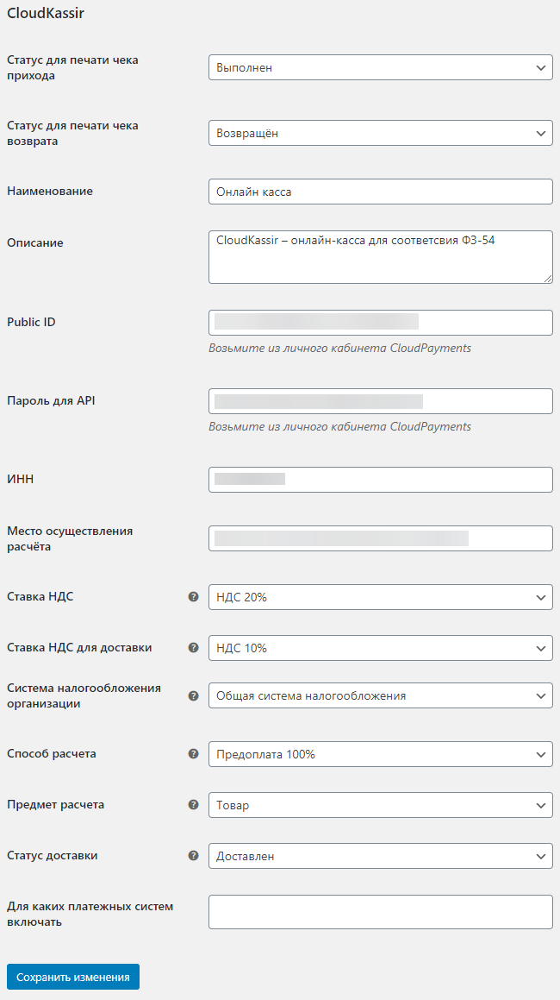

#  CloudKassir модуль для WordPress - WooCommerce
Модуль позволяет интегрировать онлайн-кассу [CloudKassir](https://cloudkassir.ru) в интернет-магазин на  WordPress - WooCommerce. 
Для корректной работы модуля необходима регистрация в сервисе.

### Возможности:  
	
* Поддержка онлайн-касс (ФЗ-54);
* Автоматическая отправка чеков прихода;
* Отправка чеков возврата;
* Отдельный параметр НДС для доставки;
* Теги способа и предмета расчета;
* Отправка чеков на email клиента;
* Отправка чеков по SMS.

### Совместимость:  
WordPress 4.9.7 и выше;  
WooCommerce 3.4.4 и выше.  

_Если вы используете платежный модуль CloudPayments совместно с модулем CloudKassir, то убедитесь, что в платежном модуле отключена отправка чеков через онлайн-кассу, во избежание дублирования кассовых чеков._

## Установка модуля
1) Скопируйте содержимое в /wp-content/plugins
2) В /wp-admin/plugins.php активируйте "WooCommerce CloudKassir Gateway"
3) /wp-admin/admin.php?page=wc-settings&tab=checkout в столбце "Включить" укажите "нет"   

## Настройка модуля
Для настройки модуля перейдиет в раздел "WooCommerce"=>"Платежи"=> CloudKassir  
  

Укажите следующие настройки:
* **Статус для печати чека прихода** - Выполнен (Если не предусматривается другой функционал);
* **Статус для печати чека возврата** - Отменен (Если не предусматривается другой функционал);
* **Public_id** - Public id сайта из личного кабинета CloudPayments;
* **Password for API** - API Secret из личного кабинета CloudPayments;
* **ИНН** - ИНН вашей организации или ИП, на который зарегистрирована касса;
* **Место осуществления расчёта** - Укажите сайт точки продаж для печати в чеке;
* **Ставка НДС** - Укажите ставку НДС товаров;
* **Ставка НДС для доставки** - Укажите ставку НДС службы доставки;
* **Система налогообложения организации** - Тип системы налогообложения;
* **Способ расчета** - признак способа расчета;
* **Предмет расчета** - признак предмета расчета;
* **Статус доставки** - Отдельный статус доставки необходим при формировании двух чеков: один чек - при поступлении денег от покупателя, второй при отгрузке товара. Отправка второго чека возможна при следующих способах расчета: Предоплата, Предоплата 100%, Аванс'.

## Вопросы/Ответы ##

### Какой порядок подключения? ###

Для подключения к сервису аренды онлайн-касс CloudKassir, необходимо выполнить следующие действия:
 * Отправить заявку на sales@cloudkassir.ru;
 * Заполнить [анкету](https://static.cloudpayments.ru/docs/anketa.docx) и оплатить полученный счет;
 * Получить номера ККТ и ФН для регистрации в ФНС;
 * Регистрация онлайн-кассы при личном посещении ФНС или в личном кабинете ФНС c [КЭП](https://cloudkassir.ru/kep).

### Как получить URL адрес с копией отправленного онлайн-чека в админ панели магазина? ###

Для получения URL адреса копии отправленного онлайн-чека в комментариях к заказу необходимо прописать в личном кабинете CloudPayments адрес для уведомления. Для этого зайдите в настройки сайта, пропишите в настройках адрес: 

* **Receipt Уведомление** (Уведомление об онлайн-чеке):\
http://domain.ru/wordpress/wc-api/wc_cloudkassir?action=receipt

Где domain.ru — доменное имя вашего сайта.

== Changelog ==  
= 2.0 =
* Добавлены теги способов и предметов расчета;
* Добавлен обработчик receipt уведомления;
* Устранены некоторые ошибки;
* Публикация плагина на маркетплейс.

= 1.0 =
* Публикация плагина на [GitHub](https://github.com/cloudpayments/CMS-WordPress-WooCommerce-CK).  

